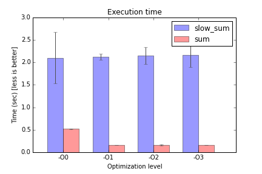

# cmc-task51
elemental profiler

## Отчет

    МОСКОВСКИЙ ГОСУДАРСТВЕННЫЙ УНИВЕРСИТЕТ
    имени М. В. ЛОМОНОСОВА
    ФАКУЛЬТЕТ ВЫЧИСЛИТЕЛЬНОЙ МАТЕМАТИКИ И КИБЕРНЕТИКИ

    Исполнитель:
    студент 320 группы
    Лютов Владимир Сергеевич

    Преподаватель:
    Бахмуров Анатолий Геннадьевич

## Тема

Измерение времени выполнения программы.

## Содержание

* [Постановка задачи](#Постановка-задачи)
* [Математическое обоснование](#Математическое-обоснование)
* [Структура программы на Си](#Структура-программы-на-Си)
* [Тестирование](#Тестирование)
* [Исходный код](#Исходный-код)
* [Полученные результаты](#Полученные-результаты)
* [Анализ ошибок](#Анализ-ошибок)

## Постановка задачи

Цель данной работы - продемонстрировать работу элементарного профайлера
(инструмента для измерения времени выполнения кода).

## Математическое обоснование

Для получения более точных результатов мы будем запускать тестируемую функцию
несколько раз. В таких условиях среднее время выполнения имеет нормальное
распределение и, с большой долей вероятности, лежит в интервале мат. ожидание
+/- 3 дисперсии (или 6 выборочных дисперсий от выборочного среднего).

## Структура программы на Си

Программа состоит из тестируемой, тестирующей функций и функции `main`.

Тестируемая функция считает сумму элементов квадратной матрицы. В первом
варианте тестируемая функция `sum` выбирает элементы по строкам матрицы -
в порядке их следования в памяти. Во втором варианте `slow_sum` она выбирает
элементы по строкам матрицы - каждый раз из разных мест в памяти, при этом кэш
используется неэффективно (постоянные промахи) и время выполнения существенно
увеличивается.

Тестирующая функция запускает тестируемую функцию много раз и выясняет среднее
время выполнения функции.

Если компиляция производится для целевой платформы `UNIX` с архитектурой
`x86_64` или `x86`, то помимо замера времени с помощью стандартной функции
`clock` будет произведен замер количества тактов необходимых для выполнения
функции с помощью команды процессора `rdtsc`. На других системах (MacOS и
Windows) программа не тестировалась и может остановиться с ошибкой.

Степень оптимизации можно задать в файле `CMakeLists.txt`
(параметр `ELPRO_OPTIMIZATION`).

Для сборки используется сборочная система [cmake](http://cmake.org).
Инструкции по сборке с помощью `cmake` в вашей операционной системе ищите
в интернете. Например, при использовании операционной системы `GNU Linux`
вы можете собрать и выполнить программу с помощью комманд:

    $ cd <PROJECT_ROOT>
    $ mkdir build && cd build
    $ cmake <PROJECT_ROOT> && make
    $ ./elpro

## Тестирование

Во время написания кода программа постоянно пересобиралась и тестировалась
по принципу "черного ящика". Работает - и хорошо.

## Исходный код

Исходный код доступен по свободной лицензии по ссылке
[https://github.com/vslutov/cmc-task51](https://github.com/vslutov/cmc-task51).
Используйте по своему усмотрению.

# Полученные результаты

    Optimization: -O0
    Profiling: sum
    Average execution time: 0.52s (+/- 0.01s)
    Profiling: slow_sum
    Average execution time: 2.10s (+/- 0.57s)

    Optimization: -O1
    Profiling: sum
    Average execution time: 0.16s (+/- 0.00s)
    Profiling: slow_sum
    Average execution time: 2.12s (+/- 0.07s)

    Optimization: -O2
    Profiling: sum
    Average execution time: 0.16s (+/- 0.01s)
    Profiling: slow_sum
    Average execution time: 2.15s (+/- 0.19s)

    Optimization: -O3
    Profiling: sum
    Average execution time: 0.16s (+/- 0.00s)
    Profiling: slow_sum
    Average execution time: 2.16s (+/- 0.26s)

Мы видим, что оптимизация компилятором - это не панацея, она не поможет, если
написан неэффективный код. Также видно, что для простых функций разные уровни
оптимизаций не имеют особых различий.

## Анализ ошибок

В ходе написания программы не было обнаружено ни архитектурных противоречий,
ни сколь-нибудь интересных програмных ошибок.
