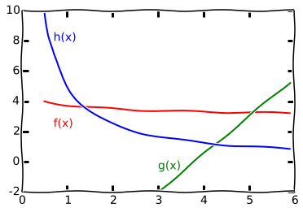

# cmc-task-one

equation solving and definite integrals

## LICENSE

    cmc-task-one - equation solving and definite integrals
    Copyright (C) 2014  V. S. Lutov

    This program is free software: you can redistribute it and/or modify
    it under the terms of the GNU General Public License as published by
    the Free Software Foundation, either version 3 of the License, or
    (at your option) any later version.

    This program is distributed in the hope that it will be useful,
    but WITHOUT ANY WARRANTY; without even the implied warranty of
    MERCHANTABILITY or FITNESS FOR A PARTICULAR PURPOSE.  See the
    GNU General Public License for more details.

    You should have received a copy of the GNU General Public License
    along with this program.  If not, see <http://www.gnu.org/licenses/>.

## Отчет

    МОСКОВСКИЙ ГОСУДАРСТВЕННЫЙ УНИВЕРСИТЕТ
    имени. М. В. ЛОМОНОСОВА
    ФАКУЛЬТЕТ ВЫЧИСЛИТЕЛЬНОЙ МАТЕМАТИКИ И КИБЕРНЕТИКИ

    Исполнитель:
    студент 104 группы
    Лютов Владимир Сергеевич

    Преподаватель:
    Гуляев Анатолий Викторович

    Вариант:
    2-4-3

### Тема

Вычисление корней уравнений и определенных интегралов

### Содержание

- [Постановка задачи](#Постановка-задачи)
- [Математическое обоснование](#Математическое-обоснование)
- [Структура программы на Си](#Структура-программы-на-Си)
- [Тестирование](#Тестирование)
- [Исходный код](#Исходный-код)
- [Полученные результаты](#Полученные-результаты)
- [Анализ ошибок](#Анализ-ошибок)

### Постановка задачи

Цель данной работы - научиться использовать сложные алгоритмы на простых
задачах. В частности - алгоритмы поиска корня нелинейного уравнения и
численного интегрирования функции.

#### Формальная постановка задачи

Даны три функции f, g и h. От нас требуется найти площадь *треугольника*,
образованного этими функциями, используя вышеуказанные алгоритмы.

В данном варианте работы требуется:

1. Реализовать **комбинированный** метод поиска корня (использующий
   одновременно и *метод касательных*, и *метод хорд*).

2. Реализовать численный метод поиска определенного интеграла с помощью
   **формулы Симпсона**.

3. В качестве функций взять:

        f = 3 * (0.5 / (x + 1) + 1)
        g = 2.5 * x - 9.5
        h = 5 / x [x > 0]

### Математическое обоснование

Рассмотрим эти функции в некотором интервале (в котором и находится искомый
*треугольник*), а именно - интервал -**[0.5; 20.0]**.

Так как разности этих функций имеют знакопостоянные первые и вторые
производные на этом интервале, мы можем использовать метод Ньютона
(метод касательных) для поиска нулей функции - то есть точек пересечения
исходных графиков.

Из знакопостоянства второй производной и формулы Тейлора следует также, что
`(f(x - dx) - f(x)) / -dx <= f'(x) <= (f(x + dx) - f(x)) / dx` для любого
положительного dx и x из этого интервала. А значит, мы можем искать производную
алгоритмически с любой наперед заданной точностью.

Посмотрим, какие погрешности можно взять:

1. Ошибка в вычислении корня на `d` дает погрешность в вычислении ответа на
  `d * f(x)` для некоторого x из d-окрестности корня.
2. Положим `M = max f, g, h на [0.5, 20.0]`
3. Возьмем `d = 0.1 * e / M`
4. Ошибку в вычислении интеграла возьмем `D = 0.1 * e`
5. Итоговая погрешность в худшем случае равна `R = 3 * d * M + 3 * D = 0.6 * e`
6. R < e

### Структура программы на Си

В заголовочном файле [apmath.h](src/apmath.h) записаны заголовки основных
функций библиотеки приблизительных вычислений.

В качестве указателя на функции используется внутренний тип Function.
Так от пользователя скрываются механизмы, стоящие за вычислением корней и
интегралов. Чтобы их вычислить, достаточно передать указатель на функцию,
границы вычислений и требуюмую погрешность.

В данной работе реализованы все методы поиска корней и численного
интегрирования, представленные в методическом пособии.

Чтобы превратить обычную фунцкию во внутреннюю, с которой работает библиотека,
достаточно применить к ней метод `wrap`.

Основная логика, вычисления результата и вывода его на экран описана в файле
[main.c](src/main.c).

### Тестирование

Тестирование библиотеки проводилось по частям, с помощью стандартного макроса
assert.

Тесты можно посмотреть в файлах из папки [tests](src/tests).

Каждый метод поиска корней были проверены на функции `10 / (x + 5) - 1` и ее
вариациях отраженных вокруг осей `OX` и `OY`.

Каждый метод интегрирования был проверен на двух функциях `3 * x * x` и
`sin(x)` на интервале от 0 до пяти.

<table><caption>Solution tests</caption><thead><tr><td>Expression</td><td>Value</td><td>Expected</td><td>EPS</td><td>Steps</td></tr></thead><tr><td>solutionBisectionMethod(Hyperbola_one, 0, 20, EPS)</td><td>5.0000003</td><td>5.0000000</td><td>0.0000010</td><td>25</td></tr><tr><td>solutionBisectionMethod(Hyperbola_two, 0, 20, EPS)</td><td>5.0000003</td><td>5.0000000</td><td>0.0000010</td><td>25</td></tr><tr><td>solutionBisectionMethod(Hyperbola_three, -20, 0, EPS)</td><td>-4.9999997</td><td>-5.0000000</td><td>0.0000010</td><td>25</td></tr><tr><td>solutionBisectionMethod(Hyperbola_four, -20, 0, EPS)</td><td>-4.9999997</td><td>-5.0000000</td><td>0.0000010</td><td>25</td></tr><tr><td>solutionChordMethod(Hyperbola_one, 0, 20, EPS)</td><td>5.0000004</td><td>5.0000000</td><td>0.0000010</td><td>24</td></tr><tr><td>solutionChordMethod(Hyperbola_two, 0, 20, EPS)</td><td>5.0000004</td><td>5.0000000</td><td>0.0000010</td><td>24</td></tr><tr><td>solutionChordMethod(Hyperbola_three, -20, 0, EPS)</td><td>-5.0000004</td><td>-5.0000000</td><td>0.0000010</td><td>24</td></tr><tr><td>solutionChordMethod(Hyperbola_four, -20, 0, EPS)</td><td>-5.0000004</td><td>-5.0000000</td><td>0.0000010</td><td>24</td></tr><tr><td>solutionNewtonsMethod(Hyperbola_one, 0, 20, EPS)</td><td>5.0000005</td><td>5.0000000</td><td>0.0000010</td><td>5</td></tr><tr><td>solutionNewtonsMethod(Hyperbola_two, 0, 20, EPS)</td><td>5.0000005</td><td>5.0000000</td><td>0.0000010</td><td>5</td></tr><tr><td>solutionNewtonsMethod(Hyperbola_three, -20, 0, EPS)</td><td>-5.0000005</td><td>-5.0000000</td><td>0.0000010</td><td>5</td></tr><tr><td>solutionNewtonsMethod(Hyperbola_four, -20, 0, EPS)</td><td>-5.0000005</td><td>-5.0000000</td><td>0.0000010</td><td>5</td></tr><tr><td>solutionCombinedMethod(Hyperbola_one, 0, 20, EPS)</td><td>5.0000004</td><td>5.0000000</td><td>0.0000010</td><td>24</td></tr><tr><td>solutionCombinedMethod(Hyperbola_two, 0, 20, EPS)</td><td>5.0000004</td><td>5.0000000</td><td>0.0000010</td><td>24</td></tr><tr><td>solutionCombinedMethod(Hyperbola_three, -20, 0, EPS)</td><td>-5.0000004</td><td>-5.0000000</td><td>0.0000010</td><td>24</td></tr><tr><td>solutionCombinedMethod(Hyperbola_four, -20, 0, EPS)</td><td>-5.0000004</td><td>-5.0000000</td><td>0.0000010</td><td>24</td></tr><tr><td>solutionCombinedMethod(Hyperbola_one, 0, 20, EPS * 10)</td><td>5.0000022</td><td>5.0000000</td><td>0.0000100</td><td>21</td></tr><tr><td>solutionCombinedMethod(Hyperbola_one, 0, 20, EPS * 100)</td><td>5.0000072</td><td>5.0000000</td><td>0.0001000</td><td>18</td></tr><tr><td>solutionCombinedMethod(Hyperbola_one, 0, 20, EPS * 1000)</td><td>5.0004155</td><td>5.0000000</td><td>0.0010000</td><td>14</td></tr><tr><td>solutionCombinedMethod(Hyperbola_one, 0, 20, EPS * 10000)</td><td>5.0023242</td><td>5.0000000</td><td>0.0100000</td><td>11</td></tr><tr><td>solutionCombinedMethod(Hyperbola_one, 0, 20, EPS * 100000)</td><td>5.0085937</td><td>5.0000000</td><td>0.1000000</td><td>8</td></tr></table>

<table><caption>Integral tests</caption><thead><tr><td>Expression</td><td>Value</td><td>Expected</td><td>EPS</td><td>Steps</td></tr></thead><tr><td>integralRectangleMethod(sqr, 0, 5.0, EPS)</td><td>124.9999999</td><td>125.0000000</td><td>0.0000010</td><td>14</td></tr><tr><td>integralRectangleMethod(wsin, 0, M_PI * 0.5, EPS)</td><td>1.0000001</td><td>1.0000000</td><td>0.0000010</td><td>10</td></tr><tr><td>integralRectangleMethod(wsin, 0, M_PI * 1.5, EPS)</td><td>1.0000001</td><td>1.0000000</td><td>0.0000010</td><td>12</td></tr><tr><td>integralRectangleMethod(dx_x_power_x, 1, 5, EPS)</td><td>3123.9999999</td><td>3124.0000000</td><td>0.0000010</td><td>19</td></tr><tr><td>integralTrapezoidalMethod(sqr, 0, 5.0, EPS)</td><td>125.0000001</td><td>125.0000000</td><td>0.0000010</td><td>15</td></tr><tr><td>integralTrapezoidalMethod(wsin, 0, M_PI * 0.5, EPS)</td><td>1.0000000</td><td>1.0000000</td><td>0.0000010</td><td>11</td></tr><tr><td>integralTrapezoidalMethod(wsin, 0, M_PI * 1.5, EPS)</td><td>0.9999999</td><td>1.0000000</td><td>0.0000010</td><td>12</td></tr><tr><td>integralTrapezoidalMethod(dx_x_power_x, 1, 5, EPS)</td><td>3124.0000001</td><td>3124.0000000</td><td>0.0000010</td><td>19</td></tr><tr><td>integralSimpsonsRule(sqr, 0, 5.0, EPS)</td><td>125.0000000</td><td>125.0000000</td><td>0.0000010</td><td>2</td></tr><tr><td>integralSimpsonsRule(wsin, 0, M_PI * 0.5, EPS)</td><td>1.0000000</td><td>1.0000000</td><td>0.0000010</td><td>5</td></tr><tr><td>integralSimpsonsRule(wsin, 0, M_PI * 1.5, EPS)</td><td>1.0000000</td><td>1.0000000</td><td>0.0000010</td><td>7</td></tr><tr><td>integralSimpsonsRule(dx_x_power_x, 1, 5, EPS)</td><td>3124.0000000</td><td>3124.0000000</td><td>0.0000010</td><td>11</td></tr><tr><td>integralSimpsonsRule(dx_x_power_x, 1, 5, EPS * 10)</td><td>3124.0000002</td><td>3124.0000000</td><td>0.0000100</td><td>10</td></tr><tr><td>integralSimpsonsRule(dx_x_power_x, 1, 5, EPS * 100)</td><td>3124.0000002</td><td>3124.0000000</td><td>0.0001000</td><td>10</td></tr><tr><td>integralSimpsonsRule(dx_x_power_x, 1, 5, EPS * 1000)</td><td>3124.0000035</td><td>3124.0000000</td><td>0.0010000</td><td>9</td></tr><tr><td>integralSimpsonsRule(dx_x_power_x, 1, 5, EPS * 10000)</td><td>3124.0000561</td><td>3124.0000000</td><td>0.0100000</td><td>8</td></tr><tr><td>integralSimpsonsRule(dx_x_power_x, 1, 5, EPS * 100000)</td><td>3124.0008974</td><td>3124.0000000</td><td>0.1000000</td><td>7</td></tr></table>

### Исходный код

Исходный код доступен по стандартной общественной лицензии GNU
[на этой странице](https://github.com/vslutov/cmc-task-one).

### Полученные результаты

Программа выдает такие результаты расчетов:

    Intersection points:
      5.0984
      4.2686
      1.3770
    Calculated area: 5.0878 (accuracy = 1e-3)

Точность расчетов можно проверить с помощью вычисления корней и интегралов на
бумаге.

f(x) = g(x):

    3 * (0.5 / (x + 1) + 1) = 2.5 * x - 9.5
    -2.5 * x * x + 10 * x + 14 = 0
    x = (10 + sqrt(240)) / 5
    x = 5.09838667697

g(x) = h(x)

    2.5 * x - 9.5 = 5 / x
    2.5 * x * x - 9.5 * x - 5 = 0
    x = (9.5 + sqrt(140.25)) / 5
    x = 4.26854385647

h(x) = f(x):

    5 / x = 3 * (0.5 / (x + 1) + 1)
    6 * x * x - x - 10 = 0
    x = (1 + sqrt(241)) / 12
    x = 1.37701455802

Результат интегрирования:

    5.0877667016528563455563095217307958235064492548449645

### Анализ ошибок

При разработке использовался метод TDD - сначала пишутся тесты, а затем код
под них и исправляются ошибки, пока все тесты не будут пройдены... затем снова
пишутся тесты. При разработке в таком стиле больших ошибок возникнуть не может,
так как код разрабатывается порциями и на каждой итерации у нас уже имеется
гарантированно рабочий код покрытый тестами.

Реализация небольшого подмножества ООП на языке Си (инкапсуляция и полиморфизм)
помогла разбить код на меньшие куски и повторно его использовать (все виды
интегрирования сделаны одним и тем же способом, несмотря на принципиально разное
устройство)

Из принципиальных проблем, решение которых так и не было найдено стоит
отметить:

- Реализации красивого наследования на Си
- Расчет погрешностей функции при поиске корня
- Вычисление математических функций точностью `1e-18`
