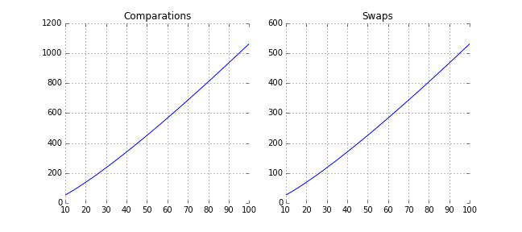
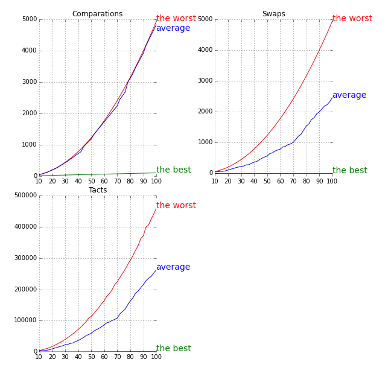
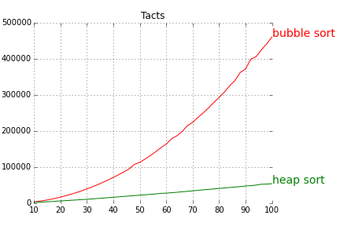

# cmc-task-three

## LICENSE

    cmc-task-three - comparation of some sort method
    Copyright (C) 2014 V. S. Lutov

    This program is free software: you can redistribute it and/or modify
    it under the terms of the GNU Affero General Public License as published by
    the Free Software Foundation, either version 3 of the License, or
    (at your option) any later version.

    This program is distributed in the hope that it will be useful,
    but WITHOUT ANY WARRANTY; without even the implied warranty of
    MERCHANTABILITY or FITNESS FOR A PARTICULAR PURPOSE.  See the
    GNU Affero General Public License for more details.

    You should have received a copy of the GNU Affero General Public License
    along with this program.  If not, see <http://www.gnu.org/licenses/>.

## Отчет

    МОСКОВСКИЙ ГОСУДАРСТВЕННЫЙ УНИВЕРСИТЕТ
    имени. М. В. ЛОМОНОСОВА
    ФАКУЛЬТЕТ ВЫЧИСЛИТЕЛЬНОЙ МАТЕМАТИКИ И КИБЕРНЕТИКИ

    Исполнитель:
    студент 104 группы
    Лютов Владимир Сергеевич

    Преподаватель:
    Гуляев Анатолий Викторович

    Вариант:
    3-5-1-5

### Тема

Сравнение методов сортировки эксперементальным методом.

### Содержание

- [Постановка задачи](#Постановка-задачи)
- [Математическое обоснование](#Математическое-обоснование)
- [Структура программы на Си](#Структура-программы-на-Си)
- [Исходный код](#Исходный-код)
- [Полученные результаты](#Полученные-результаты)

### Постановка задачи

Цель этой работы - сравнить методы сортировки по параметрам: количество
сравнений, количество обменов, время работы, проверить теоретические данные
реальным экспериментом.

### Математическое обоснование

В этой работе проверены два алгоритма сортировки - сортировка пузырьком и
пирамидальная сортировка.

#### Сортировка пузырьком

Сортировка пузырьком - простой алгоритм сортировки. Для понимания и реализации
этот алгоритм - один из самых простых, но эффективен он лишь для небольших
массивов.

Алгоритм считается учебным и практически не применяется вне учебной литературы,
вместо него на практике применяются более эффективные алгоритмы сортировки.

##### Алгоритм

Алгоритм состоит из повторяющихся проходов по сортируемому массиву. За каждый
проход элементы последовательно сравниваются попарно и, если порядок в паре
неверный, выполняется обмен элементов.
Проходы по массиву повторяются `N - 1` раз или до тех пор, пока на очередном
проходе не окажется, что обмены больше не нужны, что означает — массив
отсортирован.
При каждом проходе алгоритма по внутреннему циклу, очередной наибольший элемент
массива ставится на своё место в конце массива рядом с предыдущим «наибольшим
элементом», а наименьший элемент перемещается на одну позицию к началу массива
(«всплывает» до нужной позиции как пузырёк в воде, отсюда и название
алгоритма).

##### Код на Python (оптимизированная версия)

    for i in range(length-2):
        flag = False
        min = i
        for j in range(i, length - i - 1):
            if lst[j] > lst[j+1]:
                lst[j], lst[j+1] = lst[j+1], lst[j]
                flag = True
            if lst[min] > lst[j]:
                min = j
        if flag is False:
            break
        if min != j:
            lst[j], lst[min] = lst[min], lst[j]

Больше информации на [Wikipedia.org](http://ru.wikipedia.org/wiki/%D1%EE%F0%F2%E8%F0%EE%E2%EA%E0_%EF%F3%E7%FB%F0%FC%EA%EE%EC)

##### Математическая сложность

*Расход по памяти* в любом случае O(1): мы заводим только 4 локальных
переменных: `i`, `j`, `flag`, `min`.

*Расход по времени*

Для начала рассмотрим *лучший случай*: массив уже отсортирован.

- Число сравнений: `2 * (N - 1)`
- Число обменов: `0`

По сравнениям лучше результата уже не добиться, так как мы всегда делаем такое
число сравнений на первом проходе.

Теперь взглянем на *худший случай*: массив отсортирован в хитром порядке.

Сначала идет максимальный элемент, за ним второй максимум, следом минимум,
затем третий максимум, второй минимум, четвертый максимум, третий минимум и
т. д.

Например, для массива из 9-ти элементов это:

    9 8 1 7 2 6 3 5 4

Почему это самый худший вариант? Число сравнений на каждой итерации зависит
только от номера итерации (здесь мы делаем максимально возможное число
итераций). На каждой итерации мы можем сделать до `N - 2 * i` обменов `i` -
номер итерации (и здесь снова мы делаем их все!).

- Число проходов: `N / 2 + O(1)`
- Число сравнений: `N * N / 2 + O(N)`
- Число обменов: `N * N / 4 + O(N)`

Рассмотрим *средний случай*.

За одну итерацию мы можем восстановить порядок в `L` инверсиях,
делая `L` обменов, и еще максимум `N - 2 * i` инверсий, делая обмен минимумов
за один обмен.
Значит, матожидание количества обменов равно `O(K)` или `O(N * N)`, так как
`E(K) = N * (N - 1) / 4`.

По сравнениям примерно та же картина: `O(N * N)`.

#### Пирамидальная сортировка

Пирамидальная сортировка - алгоритм сортировки, работающий в худшем, в среднем
и в лучшем случае (то есть гарантированно) за `O(N log N)` операций при
сортировке `N` элементов.
Количество применяемой служебной памяти не зависит от размера массива
(то есть, `O(1)`).

Может рассматриваться как усовершенствованная сортировка пузырьком, в которой
элемент всплывает (`min-heap`) / тонет (`max-heap`) по многим путям.

##### Алгоритм

Сортировка пирамидой использует сортирующее дерево.

Сортирующее дерево — это такое дерево, у которого выполнены условия:

- Каждый лист имеет глубину либо `d`, либо `d - 1`, `d` — максимальная глубина
  дерева.
- Значение в любой вершине не меньше (другой вариант — не больше) значения её
  потомков.

Удобная структура данных для сортирующего дерева — такой массив `Array`, что
`Array[0]` — элемент в корне, а потомки элемента `Array[i]` являются
`Array[2i + 1]` и `Array[2i + 2]`.

Алгоритм сортировки будет состоять из двух основных шагов:

1. Выстраиваем элементы массива в виде сортирующего дерева:

        Array[i] <= Array[2i + 1]
        Array[i] <= Array[2i + 2]
        при 0 <= i < N / 2

  Этот шаг требует `O(n)` операций.

2. Будем удалять элементы из корня по одному за раз и перестраивать дерево.
  То есть на первом шаге обмениваем `Array[0]` и `Array[N - 1]`,
  преобразовываем `Array[0]`, `Array[1]`, ... , `Array[N - 2]` в сортирующее
  дерево.
  Затем переставляем `Array[0]` и `Array[N - 2]`, преобразовываем `Array[0]`,
  `Array[1]`, ... , `Array[N - 3]` в сортирующее дерево. Процесс продолжается
  до тех пор, пока в сортирующем дереве не останется один элемент.
  Тогда `Array[0]`, `Array[1]`, ... , `Array[N - 1]` -
  упорядоченная последовательность.

  Этот шаг требует `O(N log N)` операций.

##### Код на Python

    def heap_sort(array):
        def sift(i, length):
            left = 2 * i + 1
            right = left + 1
            max_child = left
            while left < length:
                if right < length && array[left] < array[right]:
                    max_child = right
                else
                    max_child = left

                if array[i] < array[max_child]:
                    array[i], array[max_child] = array[max_child], array[i]
                else
                    break

                i = max_child
                left = 2 * i + 1
                right = left + 1

        length = len(array)

        for i in range(length / 2, -1, -1):
            sift(i, length)

        for j in range(length - 1, 0, -1):
            array[0], array[j] = array[j], array[0]
            sift(0, j)

Больше информации на [Wikipedia.org](http://ru.wikipedia.org/wiki/%CF%E8%F0%E0%EC%E8%E4%E0%EB%FC%ED%E0%FF_%F1%EE%F0%F2%E8%F0%EE%E2%EA%E0)

##### Математическая сложность

*Расход по памяти* в этом алгоритме, как и в предыдущем O(1), так как тут нет
рекурсивных функций, а все переменные локальные.

*Расход по времени*

Операция `sift` над кучей выполняется в худшем случае за `O(log N)` сравнений
и присваиваний (высота дерева `h = log N`). В лучшем случае за 0
присваиваний и 1 сравнение, когда ничего не приходится перемещать.

Итак, на первый цикл от `0` до `N log N` обменов и от `N` до `2 * N log N`
сравнений. Говорят, что на второй цикл приходится не меньше, чем `O(N log N)`
обменов и сравнений. По меньшей мере, очевидно, что обменов и сравнений
происходит не больше, чем `N log N` и `2 * N log N` соответственно.

Количество присваиваний и обменов гарантированно `O(N log N) ~ C * N log N`.
К сожалению, без глубокого анализа невозможно точно назвать константу, поэтому
пусть она будет `0.8`. `C = 1.0` - худший случай, `C = 0.8` - средний.

### Исходный код

Исходный код доступен по ссылке [https://github.com/vslutov/cmc-task-three](https://github.com/vslutov/cmc-task-three).

Функции на ассемблере вынесены в отдельные файлы, как и функции сортировки
на Си. Тестирующий модуль принимает на вход сортирующую функцию и строит
по ней таблицу, делая необходимое число тестов и проверяя по ходу
погрешности вычислений.

Условная компиляция делается с помощью Make-файлов: все необходимые параметры
компиляции можно настроить прямо в [Makefile](Makefile) в корне проекта.

Иллюстрации были подготовлены с помощью библиотеки
[Matplotlib](http://matplotlib.org/).

### Полученные результаты

Число сравнений, обменов и время работы представлены в таблицах ниже.

#### Сортировка пузырьком

##### Test group 1: Sorted array

|Length      |Comparations|Swaps       |Tacts       |Time (ms)   |
|-----------:|-----------:|-----------:|-----------:|-----------:|
|          10|           9|           0|         163|         0.0|
|          20|          19|           0|         293|         0.0|
|          40|          39|           0|         585|         0.0|
|          80|          79|           0|        1078|         0.0|
|         160|         159|           0|        2099|         0.0|
|         320|         319|           0|        4110|         0.0|
|         640|         639|           0|        8122|         0.0|
|        1280|        1279|           0|       16208|         0.0|
|        2560|        2559|           0|       32306|         0.0|
|        5120|        5119|           0|       64646|         0.0|

##### Test group 2: Reverse sorted array

|Length      |Comparations|Swaps       |Tacts       |Time (ms)   |
|-----------:|-----------:|-----------:|-----------:|-----------:|
|          10|          45|          45|        4118|         0.0|
|          20|         190|         190|       17444|         0.0|
|          40|         780|         780|       72314|         0.0|
|          80|        3160|        3160|      294680|         0.0|
|         160|       12720|       12720|     1199649|         0.0|
|         320|       51040|       51040|     4790182|         2.0|
|         640|      204480|      204480|    19192155|        10.0|
|        1280|      818560|      818560|    76675208|        38.0|
|        2560|     3275520|     3275520|   306677577|       154.0|
|        5120|    13104640|    13104640|  1227252425|       614.0|

##### Test group 3: Random array

|Length      |Comparations|Swaps       |Tacts       |Time (ms)   |
|-----------:|-----------:|-----------:|-----------:|-----------:|
|          10|          44|          31|        3000|         0.0|
|          20|         162|          87|        9056|         0.0|
|          40|         780|         417|       44399|         0.0|
|          80|        3159|        1714|      189317|         0.0|
|         160|       12567|        6141|      704697|         2.0|
|         320|       50689|       25040|     2901774|         0.0|
|         640|      204344|      101675|    11860187|         6.0|
|        1280|      817687|      408659|    47389953|        24.0|
|        2560|     3273708|     1654434|   191694297|        96.0|
|        5120|    13101564|     6609637|   768414567|       386.0|

##### График (для малых размерностей)

*Интересный факт*: На почти отсортированных данных пузырек работает не сильно
хуже, чем эффективные сортировки.

#### Сортировка кучей

##### Test group 1: Sorted array

|Length      |Comparations|Swaps       |Tacts       |Time (ms)   |
|-----------:|-----------:|-----------:|-----------:|-----------:|
|          10|          41|          30|        2590|         0.0|
|          20|         121|          80|        6696|         0.0|
|          40|         321|         202|       16596|         0.0|
|          80|         809|         486|       39928|         0.0|
|         160|        1956|        1136|       94062|         0.0|
|         320|        4578|        2590|      215396|         0.0|
|         640|       10488|        5842|      489677|         0.0|
|        1280|       23599|       12946|     1090332|         0.0|
|        2560|       52463|       28586|     2424757|         0.0|
|        5120|      115225|       62596|     5305735|         2.0|
|       10240|      251120|      135500|    11507494|         6.0|
|       20480|      543343|      290422|    24707749|        14.0|
|       40960|     1168588|      621348|    52943384|        26.0|
|       81920|     2501823|     1327496|   113191304|        56.0|
|      163840|     5333830|     2821020|   240998817|       122.0|
|      327680|    11325782|     5957128|   511639350|       254.0|
|      655360|    23965989|    12585672|  1083357546|       544.0|

##### Test group 2: Reverse sorted array

|Length      |Comparations|Swaps       |Tacts       |Time (ms)   |
|-----------:|-----------:|-----------:|-----------:|-----------:|
|          10|          35|          21|        1994|         0.0|
|          20|         105|          62|        5476|         0.0|
|          40|         278|         154|       13677|         0.0|
|          80|         710|         386|       33692|         0.0|
|         160|        1736|         928|       80655|         0.0|
|         320|        4092|        2164|      187520|         0.0|
|         640|        9432|        4938|      429844|         0.0|
|        1280|       21381|       11156|      968070|         0.0|
|        2560|       48009|       24870|     2169723|         2.0|
|        5120|      106145|       54904|     4785408|         2.0|
|       10240|      232959|      119918|    10438175|         4.0|
|       20480|      506699|      261294|    22679088|        12.0|
|       40960|     1096350|      562166|    48923930|        24.0|
|       81920|     2353270|     1205344|   104862557|        54.0|
|      163840|     5035179|     2572340|   224272007|       112.0|
|      327680|    10722672|     5480752|   479061565|       240.0|
|      655360|    22787876|    11609762|  1018835945|       512.0|

##### Test group 3: Random array

|Length      |Comparations|Swaps       |Tacts       |Time (ms)   |
|-----------:|-----------:|-----------:|-----------:|-----------:|
|          10|          38|          27|        2340|         0.0|
|          20|         116|          73|        6288|         0.0|
|          40|         309|         178|       15327|         0.0|
|          80|         769|         437|       37405|         0.0|
|         160|        1868|        1045|       88840|         0.0|
|         320|        4359|        2395|      204026|         0.0|
|         640|       10013|        5434|      467408|         2.0|
|        1280|       22578|       12139|     1038042|         0.0|
|        2560|       50180|       26726|     2321773|         0.0|
|        5120|      110545|       58603|     5083762|         4.0|
|       10240|      241600|      127486|    11068150|         6.0|
|       20480|      524300|      275472|    23849650|        12.0|
|       40960|     1130858|      592082|    51321985|        26.0|
|       81920|     2425767|     1266272|   110236344|        58.0|
|      163840|     5178797|     2696224|   237452270|       120.0|
|      327680|    11013172|     5720040|   519857269|       260.0|
|      655360|    23337207|    12095420|  1160102634|       580.0|

##### График (для малых  размерностей)

*Интересный факт*: сортировка кучей работает хуже, чем в среднем, на почти
отсортированном массиве и лучше, чем в среднем, на почти отсортированном в
обратную сторону массиве.

#### Сравнение алгоритмов

Итак, мы видим, что даже на самых маленьких размерностях `Heap sort` обгоняет
`Bubble sort` на несколько порядков, и пишется не сильно сложнее, из чего
можно сделать вывод, что эффективные сортировки можно и нужно использовать в
любой задаче.

Однако, принимая во внимание тот факт, что оба этих алгоритма работают
на малых тестах *очень быстро*, можно сказать: использование квадратичных
сортировок не всегда является самым критическим местом по затрате времени в
коде, поэтому иногда их все-таки можно писать.

### Ссылки

1. [Wikipedia.org](http://ru.wikipedia.org/) - свободная энциклопедия.
2. [Opennet.ru](http://www.opennet.ru/) - портал открытого ПО.
3. [Matplotlib.org](http://matplotlib.org/) - a python 2D plotting library.
4. [Loria.fr](http://www.loria.fr/~rougier/teaching/matplotlib/) - Mathplotlib tutorial.
5. Кормен Т., Лейзерсон Ч., Ривест Р., Штайн К. Алгоритмы: построение и анализ. Второе издание. — М.: «Вильямс», 2005.

