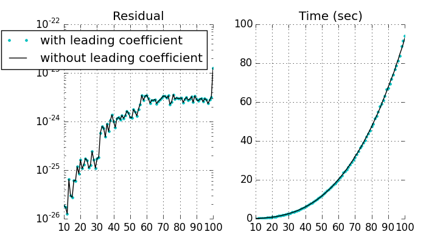
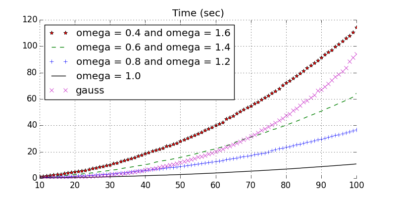

# Практическая работа N 1

* Введение в численные методы
* Прямые и итерационные методы решения СЛАУ
* Подготовил: Лютов Владимир Сергеевич, 204 группа

## Лицензия

    sle - system of linear equations solver
    Copyright (C) 2014  vslutov

    This program is free software: you can redistribute it and/or modify
    it under the terms of the GNU General Public License as published by
    the Free Software Foundation, either version 3 of the License, or
    (at your option) any later version.

    This program is distributed in the hope that it will be useful,
    but WITHOUT ANY WARRANTY; without even the implied warranty of
    MERCHANTABILITY or FITNESS FOR A PARTICULAR PURPOSE.  See the
    GNU General Public License for more details.

    You should have received a copy of the GNU General Public License
    along with this program.  If not, see <http://www.gnu.org/licenses/>.

## Подвариант 1

Решение систем линейных алгебраических уравнений методом Гаусса и методом
Гаусса с выбором главного элемента.

### Цель работы

Изучить классический метод Гаусса решения системы линейных алгебраических
уравнений.

### Постановка задачи

Дана система `Ax = f` порядка `n * n` с невырожденной матрицей `A`. Написать
программу решающую систему линейных алгебраических уравнений заданного
пользователем размера методом Гаусса и методом Гаусса с выбором главного
элемента.

Предусмотреть возможность задания элементов матрицы системы и ее правой части
как во входном файле данных, так и путем задания специальных формул.

### Цели и задачи практической работы

* Решить СЛАУ методом Гаусса и методом Гаусса с выбором главного элемента.
* Вычислить определитель матрицы det(A).
* Вычислить обратную матрицу `A^-1`.
* Исследовать вопрос вычислительной устойчивости метода Гаусса (при больших
  значениях параметра `n`.
* Правильность решения СЛАУ подтвердить системой тестов.

### Описание метода решения

Для решения этой задачи мы воспользуемся классическим методом решения СЛАУ -
[методом Гаусса](https://ru.wikipedia.org/wiki/Метод_Гаусса).

Это метод последовательного исключения переменных, когда с помощью
элементарных преобразований система уравнений приводится к равносильной
системе треугольного вида, из которой последовательно, начиная с последних
(по номеру), находятся все переменные системы.

#### Метод Гаусса

Пусть исходная система выглядит следующим образом.

    { a11 * x1 + a12 * x2 + a13 * x3 + ... + a1n * xn = b1
    { a21 * x1 + a22 * x2 + a23 * x3 + ... + a2n * xn = b2
    { a31 * x1 + a32 * x2 + a33 * x3 + ... + a3n * xn = b3
    { ...
    { an1 * x1 + an2 * x2 + an3 * x3 + ... + ann * xn = bn

Тогда матрица `A` называется основной матрицей системы, а `b` - столбцом
свободных членов.

        [a11 a12 a13 ... a1n]
        [a21 a22 a23 ... a2n]
    A = [a31 a32 a33 ... a3n]
        [... ... ... ... ...]
        [an1 an2 an3 ... ann]

        [ b1]
        [ b2]
    b = [ b3]
        [...]
        [ bn]

Тогда, согласно свойству элементарных преобразований над строками и ввиду
невырожденности матрицы A, основную матрицу этой системы можно привести к
треугольному виду (эти же преобразования нужно применять к столбцу свободных
членов):

        [ c11 c12 c13 ... c1n]
        [   0 c22 c23 ... c2n]
    C = [   0   0 c33 ... c3n]
        [ ... ... ... ... ...]
        [   0   0   0 ... cnn]

        [ d1]
        [ d2]
    d = [ d3]
        [...]
        [ dn]

Теперь решить систему `Cx = d` не составляет труда: достаточно выразить
все компоненты вектора `x` последовательно, начиная с последнего.

    xn = dn / cnn
    x(n-1) = (dn - xn * c(n-1)n)/c(n-1)(n-1)
    ...
    x1 = (d1 - xn * c1n - x(n-1) * c1(n-1) - ... - c12 * x2) / c11

Таким образом, алгоритм решения СЛАУ методом Гаусса подразделяется на два
этапа.

1. На первом этапе осуществляется так называемый прямой ход, когда путём
   перебора из элементов первого столбца матрицы выбирают ненулевой,
   перемещают его на крайнее верхнее положение перестановкой строк и вычитают
   получившуюся после перестановки первую строку из остальных строк, домножив
   её на величину, равную отношению первого элемента каждой из этих строк к
   первому элементу первой строки, обнуляя тем самым столбец под ним.
   После того, как указанные преобразования были совершены, первую строку и
   первый столбец мысленно вычёркивают и продолжают пока не останется матрица
   нулевого размера.
2. На втором этапе осуществляется так называемый обратный ход, суть которого
   заключается в том, чтобы выразить в численном виде единственное решение
   системы линейных уравнений. Эта процедура начинается с последнего уравнения,
   из которого выражают соответствующую базисную переменную и подставляют
   в предыдущие уравнения, и так далее, поднимаясь по «ступенькам» наверх.
   Каждой строчке соответствует ровно одна базисная переменная, поэтому на
   каждом шаге, кроме последнего (самого верхнего), ситуация в точности
   повторяет случай последней строки.

Метод Гаусса требует `O(n^3)` арифметических операций.

Этот метод опирается на теореме о приведении матриц к ступенчатому виду.

    Любую матрицу путём элементарных преобразований только над строками можно
    привести к ступенчатому виду.

#### Метод Гаусса-Жордана

Метод Гаусса — Жордана (метод полного исключения неизвестных) — метод, который
используется для решения квадратных систем линейных алгебраических уравнений,
нахождения обратной матрицы, нахождения координат вектора в заданном базисе
или отыскания ранга матрицы. Метод является модификацией метода Гаусса. Назван
в честь К. Ф. Гаусса и немецкого геодезиста и математика Вильгельма Жордана.

1. Выбирают первый слева столбец матрицы, в котором есть хоть одно отличное от
   нуля значение.
2. Если самое верхнее число в этом столбце ноль, то меняют всю первую строку
   матрицы с другой строкой матрицы, где в этой колонке нет нуля.
3. Все элементы первой строки делят на верхний элемент выбранного столбца.
4. Из оставшихся строк вычитают первую строку, умноженную на первый элемент
   соответствующей строки, с целью получить первым элементом каждой строки
   (кроме первой) ноль.
5. Далее проводят такую же процедуру с матрицей, получающейся из исходной
   матрицы после вычёркивания первой строки и первого столбца.
6. После повторения этой процедуры `n−1` раз получают верхнюю треугольную
   матрицу.
7. Вычитают из предпоследней строки последнюю строку, умноженную на
   соответствующий коэффициент, с тем, чтобы в предпоследней строке осталась
   только `1` на главной диагонали.
8. Повторяют предыдущий шаг для последующих строк. В итоге получают единичную
   матрицу и решение на месте свободного вектора (с ним необходимо проводить
   все те же преобразования).

Метод Гаусса-Жордана требует `O(n^3)` арифметических действий, как и
классический метод Гаусса, но проще в написании и позволяет делать другие
вещи, помимо нахождения СЛАУ, поэтому в этой работе мы будем использовать
именно эту модификацию метода Гаусса.

#### Метод Гаусса с выбором главного элемента

Помимо аналитического решения СЛАУ, метод Гаусса также применяется для
численного решения СЛАУ в технических приложениях (для уменьшения
погрешности вычислений используется Метод Гаусса с выделением главного
элемента, суть которого заключена в том, чтобы на каждом шаге в качестве
главной переменной выбирать ту, при которой среди оставшихся после
вычёркивания очередных строк и столбцов стоит максимальный по
модулю коэффициент).

### Описание программы

Программа разбита на модули. Если запустить любой из модулей, кроме
тестирующего и основного, то будут выполнены тесты, проверяющие корректность
работы функций, определенных в этом модуле.

Список модулей:

* `sle` - основной модуль, запускающий обработку данных [для инструкций
  к аргументам командной строки запустите модуль без параметров].
* `test.py` - тестирующий модуль, используйте `python test.py` для проверки
  программы на корректность.
* `matrix_functions.py` - содержит функции, необходимые для обработки матриц.

Описание всех функций есть в документации по модулям, которую можно получить с
помощью системы [pydoc](https://docs.python.org/2/library/pydoc.html),
например, выполнив команду `pydoc <имя модуля>`.

### Исходный текст модулей

    Примечание: этот и последующий пункты относятся в равной степени как к
    первому подварианту, так и ко второму.

Исходный текст модулей доступен по ссылке
[https://github.com/vslutov/sle](https://github.com/vslutov/sle).

Лицензия под которой распространяется данная программа и ее исходный код -
[GNU GPLv3](https://gnu.org/licenses/#GPL).

### Тесты

В программу включен набор тестов для каждой функции (эти тесты работают с
помощью системы [doctest](https://docs.python.org/2/library/doctest.html) и
включены прямо в строки документации).

Также есть файл test.py, который запускает помимо уже описаных тестов тесты на
работоспособность всей программы в целом. Он работает с использованием системы
[unittest](https://docs.python.org/2/library/unittest.html).

Была проверена работа алгоритма на матрицах разного размера, задаваемых
формулой. Результаты можно посмотреть в разделе **исследование**.

### Исследование

Был проведен тест метода Гаусса на автоматически сгенерированных матрицах
большого размера.

Специально сгенерированные плохие матрицы не рассматривались, но ясно, что
можно предъявить такую матрицу, на которой алгоритм без выбора главного
элемента будет показывать худшую точность по сравнению с алгоритмом с выбором.

Взглянем, с какой погрешностью выполнены равества в системе и как долго
выполняется алгоритм с выбором главного элемента и без него.

Изображение 1. График зависимости точности и скорости вычислений в методе
Гаусса от размера матрицы.

Так как в данной работе использовалось строково-числовое представление для
вычислений, погрешность получилась очень маленькая, а время работы очень
большое.

Поэтому нет особой разницы, делать или нет выбор главного элемента, так как
погрешность при обоих методах одинаковая. А время работы одинаковое, так как
деление и умножение на порядок сложнее, чем поиск лучшей строки и перестановка
строк местами.

Время работы `O(n^3)`, что является пригодным для матриц порядка `n < 100`.

### Выводы

Мы научились решать СЛАУ классическим методом Гаусса и методом Гаусса с
выбором главного элемента и исследовали вопрос о его сходимости и времени
работы на матрицах большого размера.

Относительно метода Гаусса можно сделать выводы:

* В данной реализации не важно делаем ли мы выбор главного элемента или нет.
* На хороших матрицах алгоритм работает хорошо, даже если размер матрицы
  большой, погрешность маленькая.

## Подвариант 2

Итерационные методы решения систем линейных алгебраических уравнений (на
примере метода Зейделя и верхней релаксации).

### Цель работы

Изучить классические итерационные методы (Зейделя и верхней релаксации),
используемые для численного решения систем линейных алгебраических уравнений;
изучить скорость сходимости этих методов в зависимости от выбора итерационного
параметра.

### Постановка задачи

Дана система `Ax = f` порядка `n * n` с невырожденной матрицей `A`. Написать
программу численного решения данной системы линейных алгебраических уравнений
(n - параметр программы), использующую численный алгоритм метода верхней
релаксации:

    (D + omega * Tн)(x[k+1] - x[k]) / omega + A x[k] = f

где `D` и `Tн` - соответственно диагональная и нижняя треугольные матрицы,
вырезанные из матрицы `A`, `k` - номер текущей итерации.

Предусмотреть возможность задания элементов матрицы системы и ее правой части
как во входном файле данных, так и путем задания специальных формул.

### Цели и задачи практической работы

* Решить заданную СЛАУ итерационным методом верхней релаксации.
* Разработать критерий остановки итерационного процесса, гарантирующий.
  получение приближенного решения исходной системы СЛАУ с заданной точностью.
* Изучить скорость сходимости итераций к точному решению задачи, провести
  эксперименты с различными значениями параметра `omega`
* Правильность решения СЛАУ подтвердить системой тестов.

### Описание метода решения

Рассмотрим классический итерационный метод верхней релаксации и его частный
случай - метод Зейделя.

#### Метод верхней релаксации

Введем параметр `omega` и запишем рекуррентное соотношение в виде

    (D + omega * Tн)(x[k+1] - x[k]) / omega + A x[k] = f

В случае `omega = 1`, мы получаем метод Зейделя.

Если перейти от векторной записи к записи в виде отдельных уравнений, то можно
получить для компонент очередной итерации формулы:

    first_sum  = sum A[i][j] * x[k+1][j] for j from 1 to i-1
    second_sum = sum A[i][j] * x[k][j]   for j from i to n
    x[k+1][i] = x[k][i] + omega / A[i][i] * (f[i] - first_sum - second_sum)

В случае положительно определенной матрицы `A`, метод сходится при
`0 < omega < 2`. Строгое доказательство этого факта можно прочитать в учебном
пособии *"Вводные лекции по численным методам" - Костомаров Д. П.,
Фаворский А. П. - М.: 2004*.

#### Критерий остановки итерационного процесса

Для того, чтобы найти точное решение системы нужно вспомнить, что если `x0` -
решение СЛАУ `Ax = b`, `x'` - приближение к нему, а `r = Ax' - b` - невязка,
то верны следующие высказывания.

    x' - x0 = A^-1 r
    |x' - x0| <= ||A^-1|| * |r|

Значит, длину вектора `x' - x0` можно ограничивать через длину вектора
невязки, который просто посчитать. Но норму обратной матрицы численно найти
сложно, поэтому мы воспользуемся другим методом.

В рамках этой задачи будем искать вектор `x` близкий к ответу в том смысле,
что вектор невязки достаточно мал. Ведь, ища численное решение, мы не можем
гарантировать точный ответ. Будем гарантировать такой ответ, что при
подстановке в СЛАУ мы получим приближенное равенство с достаточной точностью.

### Исследование

Был проведен тест метода верхней релаксации на автоматически сгенерированных
положительно определенных матрицах большого размера.

Специально подобранные плохие матрицы не рассматривались, но ясно, что
можно предъявить матрицу с большой нормой обратной матрицы, на которой
алгоритм будет выдавать вектор с маленькой невязкой, но очень далекий от
ответа.

Взглянем, как долго выполняется алгоритм в зависимости от параметра `omega`.
Заметим, что на данных матрицах время выполнения с параметром `omega`
оказалось таким же, как и время выполнения при параметре `2 - omega`.

Изображение 2. График зависимости скорости вычислений в методе верхней
релаксации от размера матрицы и параметра `omega`.

Мы видим, что на данных матрицах метод Зейделя показывает себя лучше других
вариаций метода верхней релаксации.

Также заметно, что в целом метод верхней релаксации работает быстрее, чем
метод Гаусса. Но и точность в этой реализации на несколько порядков ниже
среднеквадратическое отклонение невязки от нулевого вектора в данном случае на
превышало `10^-10`, в тоже время метод Гаусса показывал результат `10^-23`.

Время работы `o(n^3)`, что является пригодным для матриц большого порядка.

### Основные выводы

Мы научились решать СЛАУ классическим итерационным методом верхней релаксации
и исследовали вопрос о его сходимости и времени работы на матрицах большого
размера.

Относительно метода верхней релаксации можно сделать выводы:

* На обычных матрицах метод работает с маленькой погрешностью.
* Часто метод Зейделя оказывается самым эффективным среди методов верхней
  релаксации с разными значениями параметров.
* Метод Зейделя работает быстрее метода Гаусса и выдает результат с приемлимой
  погрешностью.
* Время работы метода верхней релаксации на данном наборе матриц `o(n^3)`.

